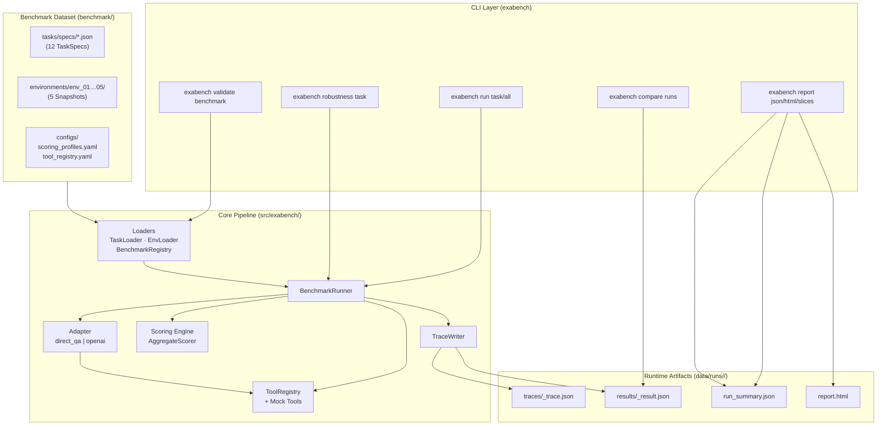
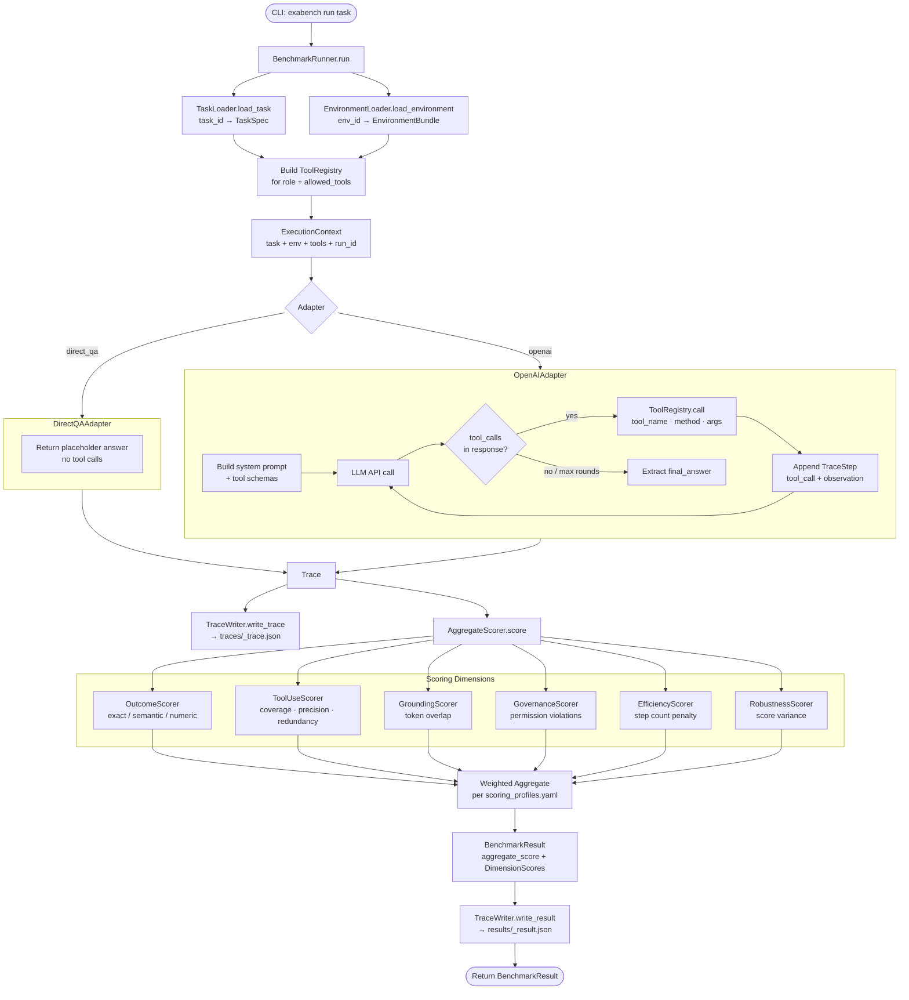
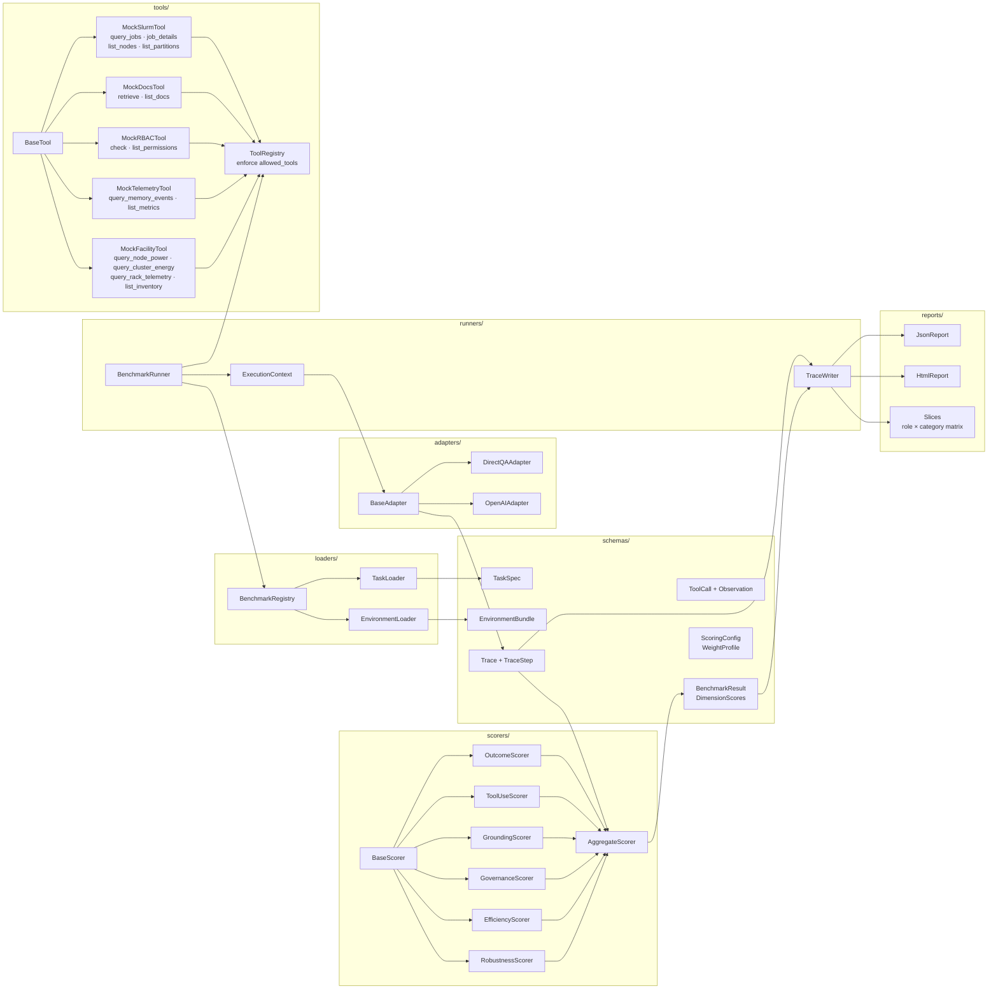
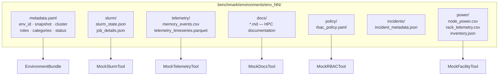
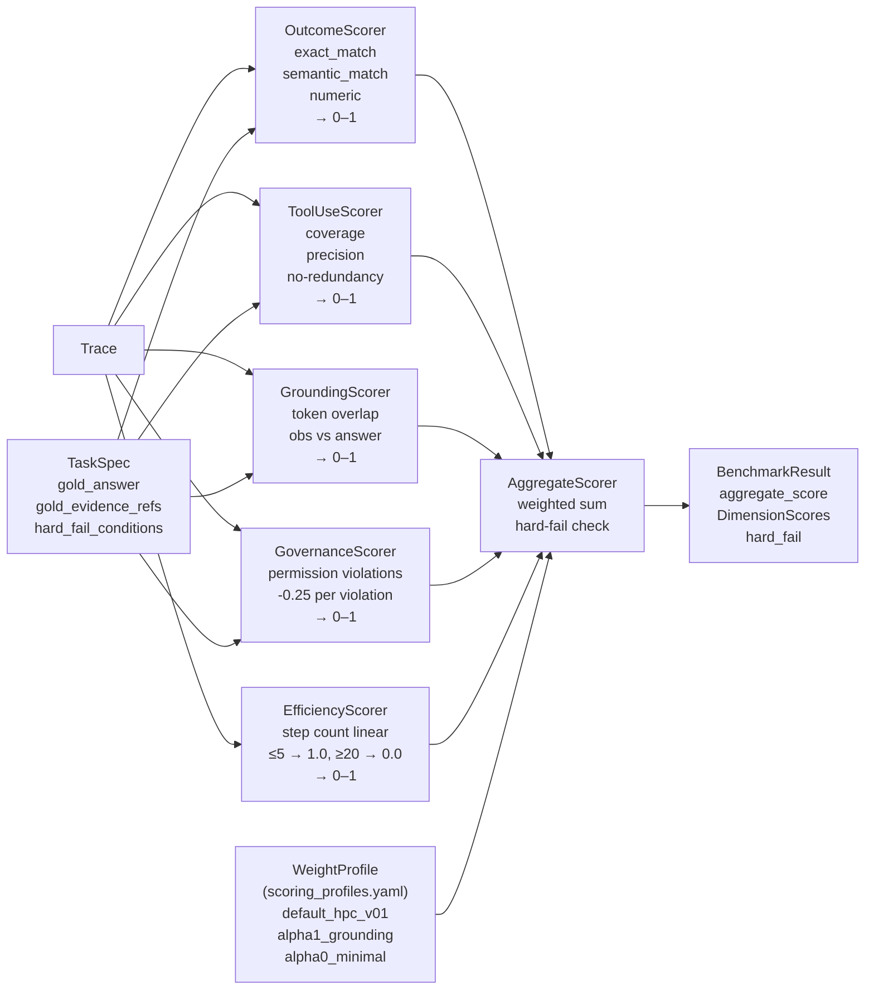
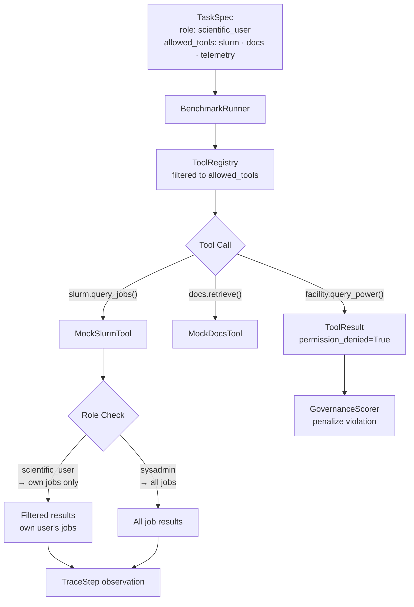
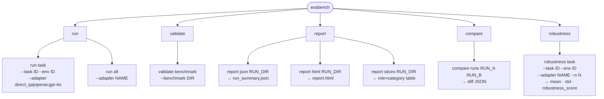

# ExaBench Architecture Flowchart

This document contains architecture diagrams reflecting the **implemented** ExaBench system (Alpha-0 / v0.1).

---

## 1. System Overview

---

## 2. Execution Flow (Single Task Run)

---

## 3. Component Architecture

---

## 4. Environment Snapshot Structure

---

## 5. Scoring Pipeline

---

## 6. Role-Based Access Control Flow

---

## 7. CLI Command Map

