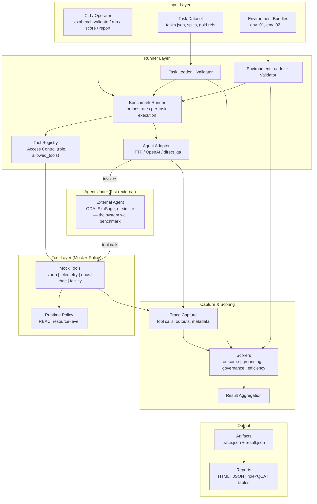

# 04 — Implementation

Owner: Mohsen

# 1. Purpose

This page defines the **software architecture and implementation plan** for **ExaBench v0.1**.

ExaBench is not just a question dataset. It is a **benchmark runtime system** for evaluating AI agents in HPC environments under:

- role-aware tasks
- deterministic environment snapshots
- controlled tool access
- trace capture
- multi-dimensional scoring

The purpose of this page is to translate the benchmark design into an executable Python system that can:

- load benchmark tasks
- load deterministic environment snapshots
- expose role-constrained mock tools
- execute benchmark runs through agent adapters
- capture structured traces
- score runs using canonical scorers
- persist results as benchmark artifacts
- generate reports and benchmark summaries

This page serves as the **implementation reference** for ExaBench v0.1. It explains the main runtime subsystems, the benchmark execution flow, the core implementation layers, and the architectural choices that make the framework reproducible, modular, and backend-independent.

It should be read together with:

- [01 — Overview](01-overview.md)
- [03 — Architecture](03-architecture.md)
- [05 — Environments](05-environments.md)
- [06 — Evaluation](06-evaluation.md)
- [07 — Taxonomy](07-taxonomy.md)

---

## Table of Contents

- [1. Purpose & Scope](#1-purpose) — What this page covers
- [2. CLI Design](#cli-design) — `exabench validate`, `exabench run`
- [3. Runtime Layers](#3-runtime-layers) — Architecture overview
- [4. Execution Workflow](#4-core-execution-workflow) — Task → environment → adapter → trace → scorers
- [5–11. Interfaces & Contracts](#5---core-data-contracts) — Task, Environment, Trace, Result, Loaders, Tools, Adapter, Runner, Scorer
- [FAQs](#do-you-need-an-api) — API, MCP, A2A, databases
- [Definition of Done](#10-definition-of-done)

---

# 2. System boundary

What ExaBench includes and what it does not include

## 1 — Scope of the Tool

The ExaBench tool is the **benchmark runtime system**. It is not the benchmark definition itself.

### It is responsible for

- task loading and validation
- environment snapshot loading
- mock tool exposure
- role and policy enforcement during execution
- agent invocation through adapters
- trace capture
- scoring execution
- result aggregation
- reporting and CLI execution

### It is not responsible for

- defining benchmark motivation
- defining benchmark taxonomy
- defining benchmark scoring philosophy
- defining benchmark task content
- defining environment semantics outside executable loading and validation rules

Those responsibilities belong to other pages in the workspace.

To keep the workspace clean and non-overlapping:

- [03](03-architecture.md) defines benchmark structure
- [05](05-environments.md) defines environment snapshots
- [06](06-evaluation.md) defines scoring and trace semantics
- [07](07-taxonomy.md) defines taxonomy and task schema
- This page defines how the software system implements those

This page must not duplicate the conceptual rationale or full scoring theory from those pages.

## CLI Design

The CLI is the primary developer and benchmark operator interface.

### `exabench validate benchmark`

Validates all task specs and environment bundles in the benchmark directory.

```bash
exabench validate benchmark
# or with custom path:
exabench validate benchmark --benchmark /path/to/benchmark
```

### `exabench run task`

Runs a single benchmark task against an environment.

```bash
exabench run task --task JOB_USR_001 --env env_01 --adapter direct_qa
# with OpenAI:
exabench run task --task JOB_USR_001 --env env_01 --adapter openai:gpt-4o-mini
# custom paths:
exabench run task -t JOB_USR_001 -e env_01 -a direct_qa --benchmark benchmark --output data/runs
```

Available adapters: `direct_qa`, `openai`, `openai:gpt-4o`, `openai:gpt-4o-mini`

### Planned CLI commands (v0.2+)

- `exabench score` — Re-score existing traces
- `exabench report` — Generate HTML/JSON benchmark reports
- `exabench compare` — Compare two runs

# Do you need an API?

## For v0.1: not necessarily

You can build ExaBench first as a **Python package + CLI**.

That is already aligned with your software page, which emphasizes commands like:

- `exabench validate`
- `exabench run`
- `exabench score`
- `exabench report`
- `exabench compare`

## When API is useful

You need an API later if you want:

- remote benchmark execution
- web dashboard
- benchmark-as-a-service
- integration with external agent platforms
- paper demo website
- multi-user run submission

## Recommendation

### v0.1

No public API required.

CLI-first is the best choice.

### v0.2+

Add a small FastAPI service if you want:

- run submission
- run history
- report retrieval
- comparison endpoints

## Best design

```
Core benchmark engine
   ├── CLI interface   (first)
   └── REST API        (later, optional)
```

So: **design the internals as API-friendly**, but do not force an API from day one.

# 3. Runtime layers

Task, environment, tools, adapter, runner, trace, scorer, report

## High-Level System Architecture

ExaBench is implemented as a layered system:

1. **Dataset Layer**
    - loads benchmark task definitions
    - validates task schema and required fields
2. **Environment Layer**
    - loads deterministic environment snapshots
    - validates snapshot metadata and contents
3. **Tool Layer**
    - exposes controlled mock tools over snapshot data
    - enforces role and access constraints
4. **Agent Adapter Layer**
    - provides a uniform interface for invoking benchmarked agents
5. **Runner Layer**
    - orchestrates task execution
    - captures traces
    - coordinates scoring
6. **Scoring Layer**
    - evaluates outputs and traces
    - computes dimension-level and aggregate scores
7. **Reporting Layer**
    - writes results
    - aggregates benchmark slices
    - produces JSON and HTML summaries
8. **CLI Layer**
    - provides the command-line entrypoints for benchmark execution

### 

# 1. What are the important parts of the framework?

These are the **important parts**. If one is missing, the framework is incomplete.

## A. Task Database

This is the benchmark dataset itself.

It defines:

- the user question
- the requester role
- the category
- allowed tools
- environment link
- success criteria
- failure modes
- required scorers
- hard-fail conditions

This is one of the most important parts because it converts your idea into executable benchmark items .

## B. Environment Snapshots

These are frozen HPC worlds.

They contain things like:

- Slurm state
- telemetry
- power/energy data
- RBAC/policy
- docs
- incident metadata

Without snapshots, the benchmark is not reproducible. This is a core design decision in your framework .

## C. Tool Layer

The agent should not read raw files directly.

Instead, it interacts through controlled tools such as:

- `slurm.job_details`
- `telemetry.query`
- `docs.retrieve`
- `rbac.check`

This is what makes the benchmark an **agent benchmark**, not only a QA benchmark .

## D. Agent Adapter Layer

A standard interface to invoke agents under evaluation.

**Primary:** Connect to deployed HPC agents (ODA, ExaSage) via HTTP or MCP. **Baselines:** direct_qa, openai for development and validation. See [architecture-clarification](../architecture-clarification.md).

## E. Runner

This is the orchestration core.

It does:

1. load task
2. load environment
3. expose allowed tools
4. invoke agent
5. capture trace
6. score run
7. save result

This is the heart of the software system .

## F. Trace Schema

You need to record:

- messages
- tool calls
- observations
- final answer
- timing
- token usage
- cost
- termination reason

Without traces, you cannot properly evaluate agent behavior .

## G. Scorers / Evaluation Layer

Your framework already points to six canonical dimensions:

- outcome
- tool use
- grounding
- governance
- robustness
- efficiency

This is one of the strongest parts of your design because it goes beyond plain accuracy .

## H. Reporting Layer

You need outputs such as:

- per-task result JSON
- run summary JSON
- HTML report
- role × category slices
- failure taxonomy summary

This makes the benchmark usable for research and paper writing .

## Reporting and Benchmark Outputs

The `exabench report` command should generate benchmark artifacts suitable for local analysis and sharing.

Outputs (v0.1):

- JSON run summary
- JSON per-task results
- self-contained HTML benchmark report
- score table by **role × QCAT**
- score breakdown across the six canonical dimensions
- failure taxonomy summary

Optional (v0.1):

- radar chart
- comparison view across runs

Note: do not treat a public “leaderboard” as the main v0.1 output unless you are explicitly building and publishing one.

# 4. Core execution workflow

**task → environment → constrained tool registry → agent adapter → trace → scorers → result → report**

## Conceptual flow

```
Task Database
    ↓
Select one task
    ↓
Load linked Environment Snapshot
    ↓
Create allowed Tool Registry for that role/task
    ↓
Run the target Agent through an Adapter
    ↓
Capture full Trace
    ↓
Apply Scorers
    ↓
Produce Result
    ↓
Aggregate into Report
```

## Very simple mental model

```
Task = what the agent is asked
Environment = frozen HPC reality
Tools = how the agent can inspect that reality
Runner = executes the benchmark
Trace = records what happened
Scorers = judge what happened
Report = summarizes results
```

## Example

A task says:

> “Why did my job 482910 fail and what should I change?”
> 

Then the framework does:

- load the task
- load `env_01`
- expose only allowed tools for `scientific_user`
- let the agent call:
    - `slurm.job_details`
    - `telemetry.query`
    - `docs.retrieve`
- capture those calls
- check whether the answer:
    - identified OOM correctly
    - used valid evidence
    - stayed within permissions
    - avoided hallucination
- save the scored result

That is how ExaBench should work structurally.

**Data Flow**

The correct v0.1 runtime flow should be:

## Benchmark run flow

1. User/operator selects a benchmark suite
2. Task loader reads and validates task records
3. Runner selects one task
4. Runner loads referenced environment snapshot
5. Runner constructs constrained tool registry for that task and role
6. Agent adapter receives:
    - query text
    - role context
    - allowed tools
    - execution context
7. Agent interacts with tools
8. Tool outputs are returned from the snapshot-backed mock environment
9. Trace collector records all steps
10. Final answer is produced
11. Scorers evaluate answer + trace + environment + task contract
12. Aggregate score and pass/fail are computed
13. Result artifacts and reports are written

That is the system behavior you should document.

## High-level architecture



**Flow:** CLI invokes runner → loads task + environment → builds role-constrained tool registry → adapter invokes the **external agent under test** (ODA, ExaSage, etc.) → agent calls mock tools (backed by env snapshot) → trace captures all steps → scorers evaluate answer + trace + env → artifacts and reports.

# How the system should work in practice

Here is the simplest correct mental model:

## ExaBench is a controlled execution loop

It works like this:

- A **task** defines what the agent must solve
- An **environment snapshot** defines the world in which it must solve it
- A **tool registry** defines what the agent is allowed to access
- An **adapter** connects ExaBench to the evaluated agent system
- A **runner** executes the scenario
- A **trace collector** records what happened
- A **scorer** judges both the answer and the process
- A **reporter** summarizes the benchmark outcome

So ExaBench is not just a dataset.

It is a **benchmark execution engine**.

That should be the central architectural sentence of your project.

# 5. Canonical entities

Task, EnvironmentSnapshot, ToolCall, Trace, Result, RunSummary

## Result Output Contract

Each run must emit a canonical result object.

### Required result properties

- `task_id`
- `run_id`
- `agent_name`
- `agent_version`
- `model_name`
- `role`
- `environment_id`
- `dimension_scores`
- `aggregate_score`
- `pass_fail`
- `trace_ref`
- `benchmark_version`

### Recommended result properties

- `hard_fail_triggered`
- `failure_reasons`
- `score_profile`
- `notes`

### Persistence rule

Every scored run must persist a standalone result artifact, for example:

`plain text data/runs/results/{run_id}.json`

# 6. Component responsibilities

One subsection per module

# Core Components

## A. Task Layer

This loads benchmark items from the task database.

It should own:

- task schema validation
- task filtering by role/category/difficulty/split
- linkage to environment IDs
- scorer requirements
- policy and tool constraints

This is already strongly defined in your Task Database page

## B. Environment Layer

This loads deterministic evaluation worlds.

It should own:

- snapshot metadata
- file bundle loading
- compatibility checks
- source registry for tools

This is central because reproducibility is one of the benchmark’s defining principles in page 03

## C. Tool Layer

This is the controlled execution surface.

The agent must never read raw snapshot files directly.

All access should go through:

- `slurm.*`
- `telemetry.*`
- `docs.*`
- `rbac.*`
- `facility.*`

This is exactly the right design direction already reflected in 03 and 07

## D. Agent Adapter Layer

This isolates ExaBench from any specific framework or provider.

**Primary use case:** ExaBench connects to deployed HPC agents (ODA, ExaSage, etc.) via HTTP, MCP, or other protocols. The adapter sends tasks and receives responses (and optionally traces).

**Baseline adapters** (OpenAIAdapter, direct_qa) exist for developing and validating the benchmark when no external agent is available. They are not the systems being benchmarked.

Adapters should support:

- Connect adapters: HTTP/FastAPI, MCP — for evaluating deployed agents
- Baseline adapters: direct_qa, openai — for pipeline validation and CI

This is critical for scientific evaluation because you want the benchmark to outlive any single framework.

## E. Runner Layer

This is the orchestration heart.

It should:

- load task
- load environment
- expose only allowed tools
- invoke agent
- capture trace
- call scorers
- persist outputs

## F. Trace Layer

This is one of your strongest ideas.

ExaBench should evaluate not only answers, but also process:

- tool call sequence
- argument quality
- evidence grounding
- policy violations
- runtime metadata

That is a real differentiator from simple QA benchmarks.

## G. Scoring Layer

This should remain modular.

Your six-family scoring structure is already strong:

- outcome
- tool_use
- grounding
- governance
- robustness
- efficiency

## H. Reporting Layer

This should generate:

- per-task result files
- aggregate summaries
- role × category slices
- failure taxonomy
- HTML report
- comparison across runs

## 6.8 — Repository Structure

The actual repository layout matches [03-architecture §11](03-architecture.md#11-repository-and-implementation-mapping) and the [README](../README.md):

```
ExaBench/
├── src/exabench/           # Python package
│   ├── schemas/            # Pydantic models
│   ├── loaders/            # Task and environment loaders
│   ├── tools/              # Mock HPC tools
│   ├── adapters/           # Agent adapters (direct_qa, openai, ...)
│   ├── runners/            # Benchmark runner
│   ├── scorers/            # Scoring engine
│   ├── reports/            # Report generation
│   ├── utils/              # Utilities
│   └── cli/                # exabench commands
├── benchmark/              # Benchmark dataset
│   ├── tasks/specs/        # Task JSON files
│   ├── environments/      # Snapshot bundles
│   ├── configs/           # Tool registry, scoring profiles
│   └── qa/                # ExaBench-QA query corpus
├── data/runs/              # Runtime artifacts (gitignored)
├── tests/
└── docs/
```

## 5 — Core Data Contracts

The implementation must treat the following as the canonical executable entities.

### 5.1 Task

Represents one benchmark item loaded from the task dataset.

Minimum executable fields:

- `task_id`
- `role`
- `qcat`
- `difficulty`
- `query_text`
- `allowed_tools`
- `preferred_tool_sequence`
- `required_tool_calls`
- `forbidden_tool_calls`
- `gold_evidence_refs`
- `permission_profile`
- `environment_id`
- `success_criteria`
- `failure_modes`
- `answer_schema`
- `eval_criteria`
- `evaluation_mode`
- `policy_constraints`
- `required_scorers`
- `hard_fail_conditions`
- `aggregate_weight_profile`

### 5.1.1 Tool and policy constraint fields (v0.1)

Example fields:

```json
{
  "preferred_tool_sequence": ["slurm.job_details", "telemetry.query", "docs.retrieve"],
  "required_tool_calls": ["slurm.job_details"],
  "forbidden_tool_calls": ["facility.get_billing_data"],
  "evaluation_mode": "semantic_match",
  "policy_constraints": {
    "max_role_scope": "scientific_user",
    "forbidden_data_scopes": ["facility_billing", "hardware_config"],
    "requires_redaction": [],
    "allowed_actions": ["read"],
    "forbidden_actions": ["modify", "terminate_job"]
  }
}
```

### 5.2 EnvironmentSnapshot

Represents one deterministic evaluation world-state.

Minimum executable fields:

- `environment_id`
- `snapshot_name`
- `scenario_type`
- `supported_roles`
- `supported_categories`
- `included_sources`
- `status`
- metadata path
- bundle root path

### 5.3 ToolCall

Represents one tool invocation during a run.

Minimum fields:

- `step`
- `tool_name`
- `arguments`
- `status`
- `latency_ms`
- `result_ref`

### 5.4 Trace

Represents the full benchmark execution record for one run.

Minimum fields are defined by [06 — Evaluation](06-evaluation.md) and must be emitted by the runner.

### 5.5 Result

Represents the scored outcome of one benchmark run.

Minimum fields are defined by [06 — Evaluation](06-evaluation.md) and must be emitted after scoring.

# 7. Repository Structure

Your existing direction is already close.

I would stabilize it as:

```
exabench/
  docs/
    00-project-framing.md
    03-architecture-benchmark-spec.md
    04-taxonomy.md
    05-task-database.md
    06-environment-snapshots.md
    07-software-architecture.md
    06-evaluation.md

  data/
    tasks/
    environments/
    gold/
    runs/
    reports/

  exabench/
    schemas/
    tasks/
    environments/
    tools/
    agents/
    runners/
    scorers/
    reports/
    cli/
    utils/

  tests/
  scripts/
  pyproject.toml
  README.md
```

## 6 — Loader Interfaces

### 6.1 Task Loader

The task loader is responsible for:

- reading task records from disk
- validating required fields
- validating schema consistency
- filtering tasks by role, category, difficulty, or split
- returning executable task objects

### Required interface

```python
class TaskLoader:
    def load_all(self, path: str) -> list[Task]:
        ...

    def load_one(self, path: str, task_id: str) -> Task:
        ...

    def filter(
        self,
        tasks: list[Task],
        roles: list[str] | None = None,
        qcats: list[str] | None = None,
        difficulties: list[str] | None = None,
        splits: list[str] | None = None,
    ) -> list[Task]:
        ...
```

### 6.2 Environment Loader

The environment loader is responsible for:

- loading snapshot metadata
- validating required files
- constructing the environment object
- exposing snapshot data to the tool layer

### Required interface

```python
class EnvironmentLoader:
    def load(self, environment_id: str, root_path: str) -> EnvironmentSnapshot:
        ...

    def validate(self, snapshot: EnvironmentSnapshot) -> ValidationReport:
        ...
```

## 7 — Tool Layer Design

The tool layer is the executable interface between the agent and the snapshot backend.

The agent must not read snapshot files directly.
All snapshot access must happen through controlled mock tools.

### 7.1 Tool responsibilities

Each tool must:

- receive validated arguments
- read from the loaded environment snapshot
- enforce access rules where applicable
- return structured outputs
- produce traceable tool call records

### 7.2 Initial v0.1 tool families

- `slurm.*`
- `telemetry.*`
- `docs.*`
- `rbac.*`
- `facility.*` (optional where needed by ENERGY/Facility tasks)

### 7.3 Example v0.1 tools

- `slurm.query_jobs()`
- `slurm.job_details(job_id)`
- `telemetry.query(metric, labels, time_range)`
- `docs.retrieve(query)`
- `rbac.check(role, resource)`
- `facility.get_rack_state(rack_id)`

### 7.4 Tool base interface

```python
class BaseTool:
    name: str

    def invoke(self, arguments: dict, context: ToolContext) -> ToolResult:
        ...
```

### 7.5 Tool registry

The runner must expose only the allowed tools for the current task and role.

```python
class ToolRegistry:
    def register(self, tool: BaseTool) -> None:
        ...

    def get_allowed_tools(self, task: Task, role: str) -> list[BaseTool]:
        ...
```

### 7.6 Access control enforcement

Access control must happen in two places:

1. **pre-execution filtering**
    - tools not allowed for the task/role are not exposed
2. **runtime policy checks**
    - even exposed tools must validate resource-level permissions

This prevents the benchmark from relying only on after-the-fact scoring of violations.

## 8 — Agent Adapter Interface

The benchmark runner invokes agents through a stable adapter contract. **Primary:** connect to deployed agents (ODA, ExaSage) via HTTP/MCP. **Baselines:** direct_qa, openai for development.

### Adapter responsibilities

An adapter must:

- receive the benchmark task input
- receive the allowed tools and execution context
- invoke the target agent system
- return:
    - final answer
    - tool call records
    - optional intermediate messages
    - token/cost metadata if available

### Required interface

```python
class BaseAgentAdapter:
    name: str
    version: str

    def run(
        self,
        task: Task,
        tools: list[BaseTool],
        context: ExecutionContext,
    ) -> AgentRunOutput:
        ...
```

### Notes

- The adapter interface must be framework-agnostic.
- OpenAI-specific, LangGraph-specific, or local-agent-specific logic must remain inside adapter modules.
- The runner must not embed provider-specific behavior.

**Future:** Later versions will support connecting to agents **deployed on HPC clusters** with access to the real cluster. ExaBench would then act as a workload driver to **stress-test production agents** under realistic conditions (latency, throughput, correctness under load).

## 9 — Runner Design

The runner is the orchestration core of ExaBench.

### Runner responsibilities

- load tasks
- load the referenced environment
- construct the allowed tool registry
- create execution context
- invoke the agent adapter
- capture a canonical trace
- invoke required scorers
- produce result objects
- persist artifacts

### Canonical runner flow

For each selected task:

1. validate task record
2. load referenced environment snapshot
3. validate environment compatibility with task role/category
4. initialize allowed tools
5. initialize execution context
6. invoke agent adapter
7. build canonical trace object
8. run required scorers
9. compute aggregate score
10. persist trace and result
11. update run summary

### Required interface

```python
class ExaBenchRunner:
    def __init__(
        self,
        task_loader: TaskLoader,
        environment_loader: EnvironmentLoader,
        adapter: BaseAgentAdapter,
        scorer_registry: ScorerRegistry,
        config: RunnerConfig,
    ):
        ...

    def run_task(self, task: Task) -> Result:
        ...

    def run_suite(self, tasks: list[Task]) -> list[Result]:
        ...
```

## 10 — Trace Output Contract

Each run must emit a canonical trace object consistent with [06 — Evaluation](06-evaluation.md).

### Required trace properties

- `task_id`
- `run_id`
- `agent_name`
- `agent_version`
- `model_name`
- `role`
- `environment_id`
- `benchmark_version`
- `start_time`
- `end_time`
- `messages`
- `tool_calls`
- `observations`
- `final_answer`
- `termination_reason`
- `token_usage`
- `cost_estimate`

### Trace contract requirements

- every tool call must be recorded
- every observation must be referenceable
- timing must be captured per run
- trace schema must be JSON-serializable
- missing optional data must be explicit rather than silently omitted

### Persistence rule

Every benchmark run must persist its trace as a standalone artifact, for example:

`plain text data/runs/traces/{run_id}.json`

## 11 — Scorer Interface

Scorers judge a run using the task definition, environment, trace, and final answer.

### Scorer responsibilities

A scorer may evaluate one dimension only.

Examples:

- outcome correctness
- tool-use correctness
- grounding quality
- governance compliance
- robustness
- efficiency

## Canonical Scorer Families

The ExaBench runner must support six canonical scorer families for v0.1:

- `outcome`
- `tool_use`
- `grounding`
- `governance`
- `robustness`
- `efficiency`

These scorer families implement the canonical evaluation dimensions defined in [06 — Evaluation](06-evaluation.md).

Process-oriented diagnostics such as planning depth, sub-goal count, or recovery markers may be recorded as auxiliary analysis metrics, but they are not part of the canonical six-dimension scorecard for v0.1 unless later promoted explicitly.

### Required interface

```python
class BaseScorer:
    name: str

    def score(
        self,
        task: Task,
        trace: Trace,
        environment: EnvironmentSnapshot,
        output: AgentRunOutput,
    ) -> ScoreResult:
        ...
```

### Scorer registry

The runner must use the task’s `required_scorers` field to select which scorers are executed.

```python
class ScorerRegistry:
    def register(self, scorer: BaseScorer) -> None:
        ...

    def resolve(self, names: list[str]) -> list[BaseScorer]:
        ...
```

### Aggregate scoring

Aggregate scoring must not be embedded inside individual scorers.

A dedicated aggregation component must:

- read dimension scores
- apply the task’s `aggregate_weight_profile`
- enforce hard-fail logic
- produce final pass/fail outcome

# 5. Interfaces / APIs

For the initial architecture, keep interfaces very small and stable.

## Must-have interfaces

### Task loader

- `load_all()`
- `load_one()`
- `filter()`

### Environment loader

- `load()`
- `validate()`

### Tool interface

- `invoke(arguments, context)`

### Agent adapter

- `run(task, tools, context)`

### Runner

- `run_task(task)`
- `run_suite(tasks)`

### Scorer

- `score(task, trace, environment, output)`

These are already consistent with what your page 07 is aiming for

# 7. Design principles

Reproducibility, modularity, backend independence, trace-first design, policy-aware execution

The runtime implementation must preserve the canonical ExaBench v0.1 benchmark principles: role-aware execution, controlled tool use, permission-aware enforcement, trace-first capture, and reproducible evaluation over deterministic environment snapshots.

The tool implementation must satisfy the following principles.

### 2.1 Reproducibility

Runs must produce deterministic behavior when given the same task, environment snapshot, tool layer, and runner configuration.

### 2.2 Modularity

Tasks, environments, tools, adapters, scorers, and reports must be implemented as separate modules with stable interfaces.

### 2.3 Backend independence

The benchmark runner must not depend on one model provider or agent framework. Agents are integrated through an adapter interface.

### 2.4 Trace-first execution

Every run must emit a structured trace that records the execution process, not only the final answer.

### 2.5 Policy-aware execution

The tool layer must enforce role and policy boundaries during execution, not merely score violations after the fact.

### 2.6 Extensibility

The v0.1 architecture must support later extension to:

- more tools
- more scorers
- more agent backends
- robustness variants
- public benchmark packaging

# 8. v0.1 boundaries

This architecture is intended to clarify the main runtime subsystems, the benchmark execution flow, the placement of tasks, environments, tools, traces, scorers, and reports, and the design choices required for reproducible and backend-independent evaluation.

The runtime is intended to be modular, reproducible, trace-first, and backend-independent.

This page should remain consistent with the canonical framing, task, environment, and evaluation pages listed above.

What is in scope and what is deferred

Do not do these yet:

- full live Slurm integration
- full HPC monitoring/telemetry integration
- complex distributed services
- production-grade web UI
- public leaderboard service
- too many agent frameworks at once

These are later phases.

For v0.1, the correct architecture is:

- local
- deterministic
- modular
- benchmark-first
- paper-friendly

# 4. Subcomponents you should have

## Core subcomponents

| Component | Purpose | Needed in v0.1? |
| --- | --- | --- |
| Task schema | defines benchmark item fields | Yes |
| Task loader/validator | loads and validates tasks | Yes |
| Environment schema | defines snapshot metadata | Yes |
| Environment loader | loads snapshot bundles | Yes |
| Tool registry | exposes allowed tools only | Yes |
| Access control module | enforces role/policy | Yes |
| Mock Slurm tool | scheduler inspection | Yes |
| Mock telemetry tool | metrics/power queries | Yes |
| Mock docs tool | retrieval grounding | Yes |
| Mock RBAC tool | permission checking | Yes |
| Facility tool | facility/energy scenarios | Optional but useful |
| Agent adapter base | standard integration interface | Yes |
| OpenAI adapter | first runnable baseline | Yes |
| Runner | orchestrates execution | Yes |
| Trace writer | stores run artifacts | Yes |
| Scorers | evaluate run | Yes |
| Aggregator | combine dimension scores | Yes |
| Report generator | summary/report output | Yes |
| CLI | run/validate/report/compare | Yes |

## 11.1 — Scorer Modules for v0.1

ExaBench v0.1 implements six canonical scorer families:

1. `outcome`
    - evaluates task correctness
    - supports exact-match, numeric-tolerance, structured-output, and semantic-match modes
2. `tool_use`
    - evaluates tool selection, argument correctness, acceptable sequence, unnecessary calls, and invalid calls
3. `grounding`
    - evaluates evidence-reference correctness, cross-source consistency, unsupported claims, and hallucination rate
4. `governance`
    - evaluates RBAC compliance, refusal correctness, redaction correctness, and restricted-data leakage
5. `robustness`
    - evaluates repeated-run consistency, degraded-condition behavior, timeout recovery, and ambiguity handling
6. `efficiency`
    - evaluates wall-clock latency, token usage, tool-call count, and estimated cost

### Optional diagnostic process metrics

The runner may also compute non-canonical diagnostic metrics such as:

- planning-step count
- sub-goal completion markers
- recovery-after-error markers

These are useful for analysis but are not part of the canonical six-dimension scorecard in v0.1.

## 14 — Validation Rules for v0.1

Before implementation is considered stable, the tool must validate the following:

### Task validation

- required task fields exist
- `environment_id` is defined
- `allowed_tools` is non-empty when required
- `evaluation_mode` is valid
- `preferred_tool_sequence` tools exist
- `required_tool_calls` are allowed
- `forbidden_tool_calls` are not exposed
- `policy_constraints` schema is valid
- `required_scorers` are valid
- `aggregate_weight_profile` is valid

### Environment validation

- referenced environment exists
- required metadata exists
- declared files exist
- supported roles are declared
- supported categories are declared

### Cross-entity validation

- every task references exactly one valid environment
- task role is allowed by the environment
- task category is supported by the environment
- required tools are resolvable
- required scorers are registered

# 6. Technology Choices

## For v0.1, I recommend

| Layer | Recommendation |
| --- | --- |
| Language | Python |
| Schemas | Pydantic |
| Storage | JSON / YAML / CSV + local files |
| Environment state | snapshot bundles on disk |
| Tool backend | pure Python mock tools |
| Report generation | Jinja2 + HTML |
| CLI | Typer or Click |
| Testing | pytest |
| Baselines | direct QA, RAG, tool-agent |
| Result storage | JSON artifacts per run |

## Why this is the right choice

Because v0.1 should optimize for:

- reproducibility
- debugability
- paper-ready experiments
- low infrastructure overhead

Not for distributed production deployment.

So do **not** over-engineer this into Kubernetes or microservices yet.

At this stage, ExaBench should be a **well-architected local benchmark engine**, not a cloud platform.

# Best architecture decision for your current stage

Here is the strongest version for your current project.

## Recommended v0.1 architecture

```
ExaBench v0.1
├── Task Database
├── Environment Snapshot Bundles
├── Mock Tool Layer
├── Access-Control / Policy Layer
├── Agent Adapter Interface
├── Runner
├── Trace Store
├── Scorers
├── Result Store
├── Reporting
└── CLI
```

## Explicitly not required for v0.1

- live Slurm integration
- live HPC monitoring/telemetry integration
- heavy database stack
- public REST API
- A2A-first architecture
- MCP-first architecture
- multi-agent orchestration
- production microservices deployment

# Which are important parts of this framework?

The most important parts are:

- Task Database
- Environment Snapshots
- Tool Layer
- Access Control / RBAC
- Agent Adapter
- Runner
- Trace Schema
- Scorers
- Reports

## Do I need databases?

Yes, but only lightweight storage at first.

Use files + optional SQLite.

Do not start with heavy DB infrastructure.

## Do I need API?

Not for v0.1.

CLI-first is enough.

Design the core so an API can be added later.

## Do I need Agent-to-Agent communication?

No for v0.1.

Only later if you want to benchmark multi-agent systems.

## Do I need MCP?

No for the core benchmark.

It is optional for interoperability later.

# 9. Risks and non-goals

Live cluster integration, multi-agent orchestration, public leaderboard, distributed execution

# Do you need databases?

## Yes — but not a heavy database at the beginning

For **v0.1**, you do **not** need PostgreSQL or a big distributed DB.

Your own pages already lean toward:

- local files
- structured JSON/YAML
- CSV/Parquet
- possibly SQLite

That is the correct choice for your first version .

## Recommended v0.1 storage design

### Use files for:

- task definitions: JSON or YAML
- environment metadata: YAML
- traces: JSON
- results: JSON
- reports: HTML + JSON
- docs bundle: Markdown files
- telemetry: Parquet / CSV
- scheduler state: JSON

### Use SQLite optionally for:

- task indexing
- run metadata
- result querying
- experiment tracking

## My recommendation

### For now:

Use **file-based benchmark artifacts + optional SQLite**.

### Do not start with:

- PostgreSQL
- Elasticsearch
- vector DB
- distributed event store

unless later you want a public service or leaderboard.

## Bottom line on databases

You need **data storage**, yes.

You do **not** need a large database architecture yet.

For ExaBench v0.1, this is enough:

```
JSON/YAML/CSV/Parquet + SQLite (optional)
```

# 8. Do you need MCP?

## For the benchmark core: no

You do **not** need MCP as a requirement for ExaBench itself.

Why?

Because ExaBench is the benchmark owner.

You already control the tool layer.

You can define a clean Python tool interface directly.

## What matters more than MCP

The important thing is that the benchmark has a stable internal tool contract, for example:

- tool name
- argument schema
- return schema
- permission checks
- traceability

That can be implemented perfectly well without MCP.

## When MCP is useful

MCP is useful if:

- you want to benchmark agents that already consume MCP tools
- you want to expose your mock tools as MCP servers
- you want interoperability with external ecosystems

## Recommendation

### v0.1

Implement tools as **native Python mock tools**.

### Optional later

Add an MCP wrapper layer:

```
Mock Tool Backend
   ├── Native Python interface
   └── MCP interface adapter
```

## Important distinction

- **Need for benchmark correctness?** No.
- **Useful for interoperability?** Yes.
- **Should it be core in v0.1?** No.

# 7. Do you need Agent-to-Agent communication?

## For v0.1: no

You explicitly do **not** need multi-agent orchestration for the first version.

Your own framing page already says complex multi-agent orchestration belongs to later stages, not v0.1 .

## Why not needed now

Because your benchmark question is currently:

> Can one agent solve the task correctly, safely, reproducibly, and efficiently?
> 

You do not need multiple agents talking to each other to answer that.

## When A2A becomes useful

A2A becomes useful only if later you benchmark systems like:

- coordinator agent + telemetry agent + policy agent
- planner agent + retriever agent + diagnosis agent
- distributed operational copilots

Then you may want to evaluate:

- delegation quality
- inter-agent messaging
- coordination overhead
- failure propagation across agents

## Recommendation

### v0.1

Do **not** build A2A into the core architecture.

### Later

Support it as an **advanced execution mode**.

# 10. Definition of done

What counts as an end-to-end working initial architecture

Minimum v0.1 Definition of Done

The ExaBench tool for v0.1 is considered minimally complete when:

- a task can be loaded from the benchmark dataset
- its referenced environment snapshot can be loaded and validated
- allowed tools can be exposed under role constraints
- an agent can be invoked through the adapter interface
- a canonical trace can be emitted
- required scorers can score the run
- a canonical result can be written
- a benchmark summary report can be generated